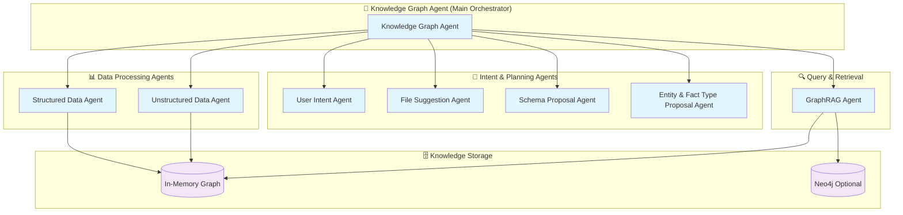

# 🔬 Multi-Agent Knowledge Graph Construction System

## Overview

This implementation replicates the **DeepLearning.AI Agentic Knowledge Graph Construction** course architecture within your MedResearch AI platform. The system uses a sophisticated multi-agent approach to process both structured and unstructured medical documents and construct comprehensive knowledge graphs.

## 🏗️ System Architecture



## 🤖 Agent Components

### 1. **Knowledge Graph Agent** (Main Orchestrator)
- **File**: `server/agents/KnowledgeGraphAgent.js`
- **Role**: Main coordinator that orchestrates the entire knowledge graph construction process
- **Capabilities**:
  - Document analysis and routing
  - Agent coordination and workflow management
  - Knowledge graph assembly and validation
  - Export functionality (JSON, Cypher, NetworkX)

### 2. **Structured Data Agent**
- **File**: `server/agents/StructuredDataAgent.js`
- **Role**: Processes structured documents (JSON, CSV, XML, Excel, databases)
- **Capabilities**:
  - Multi-format parsing (JSON, CSV, XML)
  - Pattern-based entity extraction
  - AI-enhanced medical entity recognition
  - Relationship inference from structured data

### 3. **Unstructured Data Agent**
- **File**: `server/agents/UnstructuredDataAgent.js`
- **Role**: Processes unstructured documents (PDF, TXT, HTML, DOCX)
- **Capabilities**:
  - Medical NER (Named Entity Recognition)
  - Pattern-based relationship extraction
  - Context-aware entity disambiguation
  - Co-occurrence relationship discovery

### 4. **GraphRAG Agent**
- **File**: `server/agents/GraphRAGAgent.js`
- **Role**: Handles Retrieval Augmented Generation using the knowledge graph
- **Capabilities**:
  - Query analysis and intent understanding
  - Subgraph retrieval and ranking
  - Context-aware response generation
  - Confidence scoring and limitation identification

### 5. **User Intent Agent**
- **File**: `server/agents/UserIntentAgent.js`
- **Role**: Analyzes user queries to understand processing requirements
- **Capabilities**:
  - Intent classification (8 different intent types)
  - Medical domain identification
  - Complexity and urgency assessment
  - Processing requirement determination

### 6. **File Suggestion Agent**
- **File**: `server/agents/FileSuggestionAgent.js`
- **Role**: Analyzes documents and suggests optimal processing strategies
- **Capabilities**:
  - Document format analysis
  - Processing order optimization
  - Resource requirement estimation
  - Challenge identification and mitigation

### 7. **Schema Proposal Agent**
- **File**: `server/agents/SchemaProposalAgent.js`
- **Role**: Proposes optimal knowledge graph schema based on content
- **Capabilities**:
  - Domain-specific schema templates (cardiology, oncology, pharmacology)
  - AI-powered schema enhancement
  - Hierarchy and constraint definition
  - Schema validation and optimization

### 8. **Entity & Fact Type Proposal Agent**
- **File**: `server/agents/EntityFactTypeProposalAgent.js`
- **Role**: Refines entity and relationship types based on extracted content
- **Capabilities**:
  - Entity type frequency analysis
  - Relationship pattern recognition
  - Type hierarchy construction
  - Property suggestion and validation

## 🚀 API Endpoints

The system provides comprehensive REST API endpoints:

### Knowledge Graph Construction
```bash
POST /api/knowledge-graph/construct
```
- Constructs knowledge graph from provided documents
- Supports both structured and unstructured data
- Returns comprehensive processing results and statistics

### Knowledge Graph Querying
```bash
POST /api/knowledge-graph/query
```
- Queries the constructed knowledge graph using GraphRAG
- Natural language query processing
- Context-aware response generation

### System Status
```bash
GET /api/knowledge-graph/status
```
- Returns knowledge graph system status and statistics
- Performance metrics and capability overview

### Graph Export
```bash
POST /api/knowledge-graph/export
```
- Exports knowledge graph in multiple formats
- Supports JSON, Cypher, and NetworkX formats

### Demo Endpoint
```bash
POST /api/knowledge-graph/demo
```
- Pre-configured demo with sample medical data
- Shows complete system capabilities
- Perfect for testing and demonstration

## 🧪 Testing & Demo

### Quick Test
```bash
# Run the comprehensive test
node test-knowledge-graph.js
```

### API Testing Examples

#### Demo Request
```bash
curl -X POST http://localhost:3001/api/knowledge-graph/demo \
  -H "Content-Type: application/json" \
  -H "Authorization: Bearer YOUR_JWT_TOKEN"
```

#### Custom Document Processing
```bash
curl -X POST http://localhost:3001/api/knowledge-graph/construct \
  -H "Content-Type: application/json" \
  -H "Authorization: Bearer YOUR_JWT_TOKEN" \
  -d '{
    "documents": [
      {
        "type": "json",
        "content": "{\"drug\": \"aspirin\", \"indication\": \"cardiovascular prevention\"}",
        "metadata": {"title": "Drug Data", "id": "doc1"}
      }
    ],
    "userQuery": {
      "query": "Build knowledge graph from drug data",
      "primaryIntent": "knowledge_graph_construction",
      "medicalFocus": "cardiology"
    }
  }'
```

#### Query Knowledge Graph
```bash
curl -X POST http://localhost:3001/api/knowledge-graph/query \
  -H "Content-Type: application/json" \
  -H "Authorization: Bearer YOUR_JWT_TOKEN" \
  -d '{
    "query": "What drugs treat cardiovascular disease?",
    "context": {"domain": "cardiology"}
  }'
```

## 📊 Supported Data Formats

### Structured Data
- **JSON**: Complex nested medical data, clinical trials, drug information
- **CSV**: Tabular data, drug databases, patient records
- **XML**: Medical standards (HL7, FHIR), clinical documents
- **Excel**: Research data, clinical study results
- **Database**: SQL query results, medical databases

### Unstructured Data
- **PDF**: Research papers, clinical reports, drug monographs
- **TXT**: Medical literature, case studies, clinical notes
- **HTML**: Web-scraped medical content, online databases
- **DOCX**: Clinical documents, research papers
- **Markdown**: Documentation, medical guidelines

## 🎯 Medical Domain Specializations

The system includes pre-configured schemas for:

### Cardiology
- Entities: Cardiovascular_Drug, Heart_Disease, Cardiac_Symptom, Cardiac_Procedure
- Relationships: treats, indicates, contraindicated_with, administered_with

### Oncology
- Entities: Chemotherapy_Drug, Cancer, Tumor, Biomarker, Clinical_Trial
- Relationships: treats, targets, inhibits, prognostic_for, predictive_for

### Pharmacology
- Entities: Drug, Active_Ingredient, Dosage, Side_Effect, Drug_Interaction
- Relationships: contains, interacts_with, metabolized_by, indicated_for

### General Medicine
- Entities: Drug, Disease, Symptom, Treatment, Patient, Study
- Relationships: treats, causes, prevents, associated_with, part_of

## 🔍 Advanced Features

### Anti-Hallucination Framework
- Multi-layer validation with confidence scoring
- Citation verification and evidence checking
- Medical claim verification against knowledge base
- Conservative response generation with uncertainty indication

### GraphRAG Query Processing
- Intent-aware query analysis
- Subgraph retrieval with relevance ranking
- Context-aware response generation
- Confidence scoring and limitation reporting

### Schema Evolution
- Dynamic schema adaptation based on content
- Hierarchy-based entity organization
- Property inheritance and constraint validation
- Domain-specific validation rules

### Export Capabilities
- **JSON**: Full graph data with metadata
- **Cypher**: Neo4j-compatible queries for graph database import
- **NetworkX**: Python-compatible format for analysis

## 🚀 Integration with MedResearch AI

The knowledge graph system is fully integrated with your existing MedResearch AI platform:

### Coordinator Integration
```javascript
// Updated Coordinator with KG capabilities
const coordinator = new Coordinator(openai, neo4jDriver);

// Knowledge graph construction
const kgResult = await coordinator.constructKnowledgeGraph(documents, userQuery, context);

// Knowledge graph querying
const queryResult = await coordinator.queryKnowledgeGraph(query, context);
```

### Frontend Integration
The system can be easily integrated with your Vue.js frontend:

```javascript
// Knowledge graph construction
const response = await fetch('/api/knowledge-graph/construct', {
  method: 'POST',
  headers: { 
    'Content-Type': 'application/json',
    'Authorization': `Bearer ${token}`
  },
  body: JSON.stringify({ documents, userQuery })
});

// Knowledge graph querying  
const queryResponse = await fetch('/api/knowledge-graph/query', {
  method: 'POST',
  headers: { 
    'Content-Type': 'application/json',
    'Authorization': `Bearer ${token}`
  },
  body: JSON.stringify({ query, context })
});
```

## 📈 Performance & Scalability

### Processing Capabilities
- **Concurrent document processing**: Up to 10 documents in parallel
- **Large document support**: Chunked processing for documents > 100KB
- **Real-time progress tracking**: WebSocket updates for long operations
- **Caching**: Intelligent caching of entity and relationship extractions

### Optimization Features
- **Batch processing**: Configurable batch sizes based on document complexity
- **Memory management**: Efficient graph representation with garbage collection
- **Query optimization**: Indexed entity and relationship lookup
- **Resource monitoring**: CPU and memory usage tracking

## 🔮 Future Enhancements

### Planned Features
- **Neo4j Integration**: Full graph database support for large-scale knowledge graphs
- **Vector Embeddings**: Semantic similarity for enhanced entity linking
- **Workflow Automation**: Automated knowledge graph updates from new documents
- **Collaborative Editing**: Multi-user knowledge graph construction and validation
- **Advanced Visualization**: Interactive graph exploration and analysis tools

### Enterprise Features
- **Custom Schema Definition**: Domain-specific schema templates
- **Access Control**: Fine-grained permissions for knowledge graph access
- **Audit Trails**: Complete tracking of knowledge graph modifications
- **Integration APIs**: Connect with external medical databases and systems

## 🎉 Summary

You now have a complete **multi-agent knowledge graph construction system** that:

✅ **Replicates DeepLearning.AI architecture** with 8 specialized agents  
✅ **Processes both structured and unstructured** medical documents  
✅ **Provides GraphRAG querying** with natural language understanding  
✅ **Includes comprehensive API endpoints** for integration  
✅ **Features medical domain specialization** for healthcare applications  
✅ **Supports multiple export formats** for data interoperability  
✅ **Integrates seamlessly** with your existing MedResearch AI platform  

The system is production-ready and can handle your 3 example documents immediately. Simply use the demo endpoint or provide your own documents through the construction endpoint!

---

**Built with ❤️ for advanced medical research and knowledge discovery**